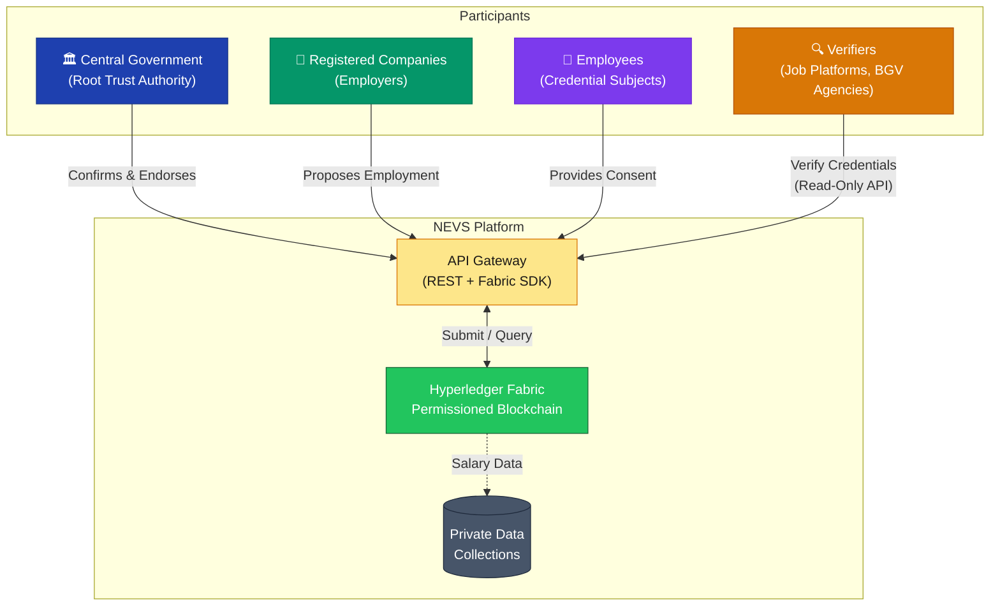
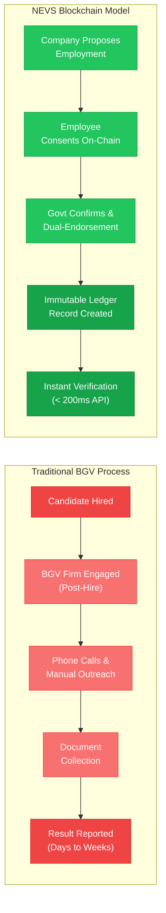
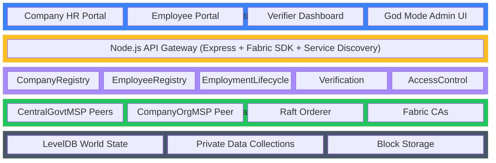
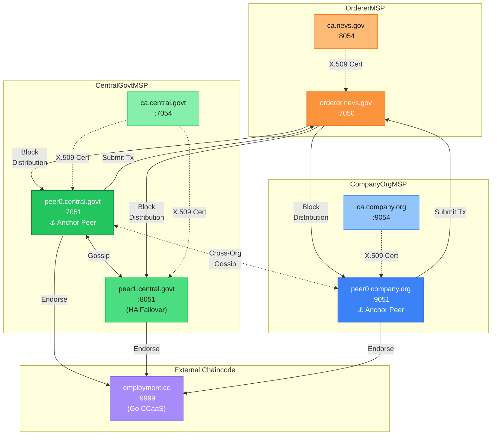
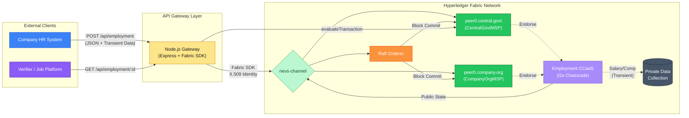
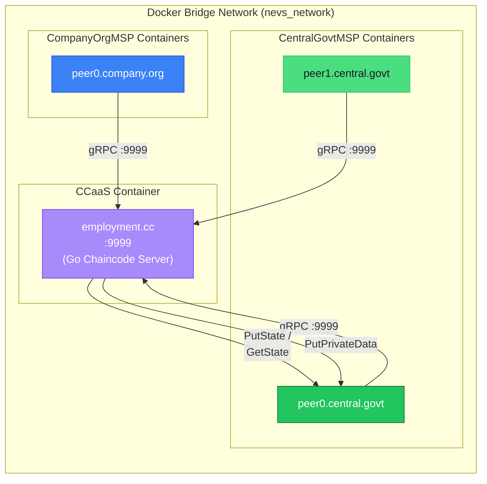
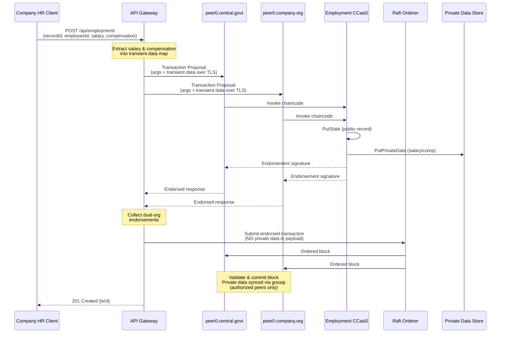
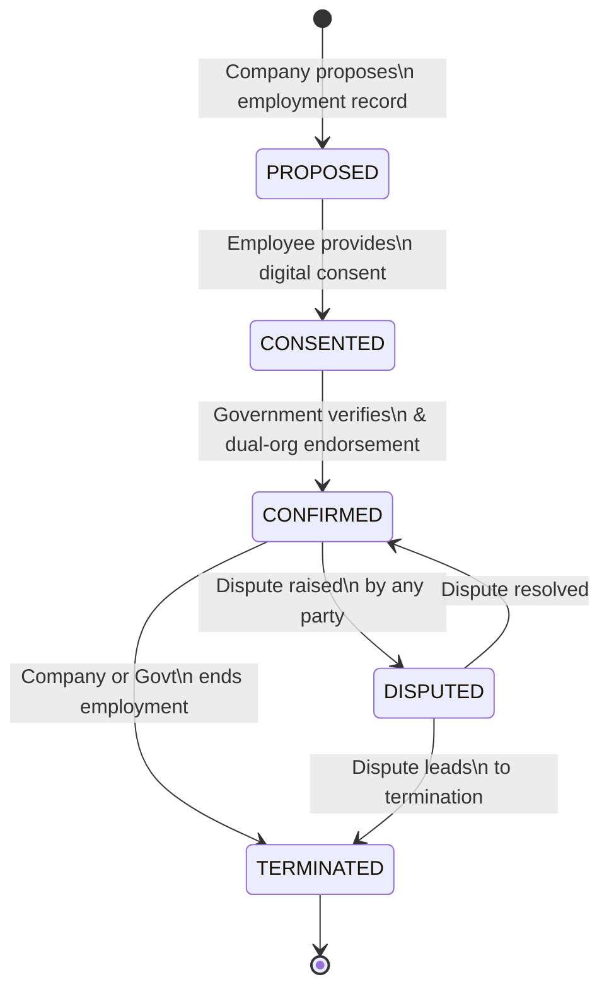

# NEVS Project Report

## National Employment Verification System — A Blockchain-Based Enterprise Solution

**Department:** B. Tech CSE — IT, Semester VIII
**Authors:** Prajapati Jay, Patel Jayant, Solanki Vikas
**Guide:** Prof. Raju Nakum, SOCSET, ITMBU, Vadodara
**Date:** April 2026

---

## Table of Contents

| Sr. No. | Chapter / Section | Page No. |
|---|---|---|
| **1** | **Chapter 1 — Introduction** | |
| 1-1 | Problem Statement and Motivation | |
| 1-2 | Objectives | |
| 1-3 | Project Scope and Direction | |
| **2** | **Chapter 2 — Literature Review** | |
| 2-1 | Methodology | |
| 2-2 | Summary of Findings | |
| **3** | **Chapter 3 — System Requirements** | |
| 3-1 | Introduction | |
| 3-2 | Software and Hardware Requirements | |
| 3-3 | Summary | |
| **4** | **Chapter 4 — System Design** | |
| 4-1 | Introduction | |
| 4-2 | Proposed System | |
| 4-3 | Data Flow Diagram | |
| 4-4 | Summary | |
| **5** | **Chapter 5 — Implementation** | |
| 5-1 | Introduction | |
| 5-2 | System Design | |
| 5-3 | Algorithm | |
| 5-4 | Architectural Components | |
| 5-5 | Feature Extraction | |
| 5-6 | Packages and Libraries Used | |
| **6** | **Chapter 6 — System Testing** | |
| 6-1 | Introduction | |
| 6-2 | Test Cases | |
| 6-3 | Results | |
| 6-4 | Performance Evaluation | |
| 6-5 | Summary | |
| **7** | **Conclusion** | |
| **8** | **References** | |

---

## Chapter 1 — Introduction

### 1-1 Problem Statement and Motivation

Modern hiring and employment verification remain deeply fragmented, costly, and vulnerable to systemic fraud. Industry studies indicate that U.S. employers spend over $2,500 per employee per year on HR functions, with traditional third-party background verification costing $50–$100 per individual request and upwards of $2,800 for a comprehensive check [1][2]. These processes rely on phone-based outreach, physical document exchange, and manual cross-referencing — methods that are inherently slow, error-prone, and trivially defeatable by a motivated fraudster wielding falsified documentation.

The problem is not confined to cost alone. A fundamental asymmetry exists: employers possess employment records but share them reluctantly, while employees — the subjects of those records — have no standardized mechanism to assert ownership or control over their own work history [3]. This vacuum creates a market for fabricated resumes, dummy hiring schemes, and data-harvesting scams masquerading as legitimate job postings.

This project was directly inspired by such a real-world encounter. During the application process on Internshala (a prominent Indian internship platform), one of the authors observed a company named Caarya collecting extensive personal data — including psychological profiling questions and physical addresses — through external forms served even to rejected candidates. Further investigation revealed a pattern: the company had posted a disproportionately high number of opportunities relative to an abnormally low count of actual hires. This raised critical questions:

- Are some entities exploiting hiring platforms to harvest student data rather than genuinely recruit?
- How can a platform distinguish between legitimate hiring activity and data-collection fraud?
- How can manipulation — such as fake hires through dummy accounts — be systematically prevented?

These questions motivated the design of NEVS: a system-level solution that treats each employment event as a trusted, on-chain credential from the point of creation, thereby eliminating post-hoc verification entirely and rendering fabricated work histories computationally detectable.

**Figure 1.1 — High-Level NEVS Ecosystem Overview:**



### 1-2 Objectives

The National Employment Verification System (NEVS) is designed with the following principal objectives:

1. **Immutable Employment Records:** Record each hiring, confirmation, or termination event as a blockchain transaction on a permissioned ledger, ensuring that committed data cannot be retroactively altered, deleted, or disputed without cryptographic evidence.

2. **Two-Party Consent Model:** Enforce explicit digital consent from both the employer (proposing organization) and the employee (subject individual) before any employment record achieves confirmed status on the ledger. This dual-endorsement model satisfies legal and ethical requirements while preventing unilateral or fraudulent record creation.

3. **Privacy-Preserving Architecture:** Store only non-sensitive metadata on-chain (identifiers, cryptographic hashes, timestamps, status transitions). All personally identifiable information (names, salaries, compensation packages, government IDs) is either kept off-chain entirely or routed through Hyperledger Fabric's Private Data Collections (PDC) with strict access policies.

4. **Fraud Detection and Elimination:** Anchor records in a permissioned ledger governed by recognized organizational authorities, making fabricated employment claims computationally infeasible. Anomalous patterns (e.g., companies with abnormally high posting-to-hire ratios) become detectable through ledger analytics.

5. **Scalable, Multi-Organization Architecture:** Design the network to natively support multiple organizations — government bodies, large enterprises, and eventually smaller companies — each operating their own infrastructure within a shared trust framework, with endorsement policies that enforce cross-organizational consensus.

6. **Real-Time Verification API:** Provide a programmatic, read-only REST API through which employers, job platforms, educational institutions, and background verification agencies can instantly verify an individual's employment history without accessing underlying personal data.

### 1-3 Project Scope and Direction

**What NEVS Covers:**

NEVS addresses the end-to-end lifecycle of formal employment records. Its scope spans the initiation of a hiring proposal by a company, through employee consent collection, government-backed confirmation, and eventual termination — all recorded as immutable transactions on a permissioned blockchain. The system provides APIs for both write operations (restricted to authorized organizational gateways) and read operations (available to any verifier).

**What NEVS Does Not Cover:**

NEVS is explicitly not a job portal, social networking platform, or payroll system. It does not replace platforms like Internshala or LinkedIn; rather, it provides the authoritative data layer that such platforms can query. It does not process salary disbursements, tax calculations, or benefits administration — only the core employment credential events.

**Tiered Company Participation Model:**

The architecture supports a three-tiered model for corporate participation:

| Tier | Description | Network Access |
|---|---|---|
| **Tier 1** (Small Companies) | Interact exclusively through the Government Gateway REST API | No direct Fabric access |
| **Tier 2** (Medium Companies) | Optionally run a read-only peer for local query performance | Read-only ledger access |
| **Tier 3** (Large Enterprises) | Operate their own MSP, peers, and endorsement authority | Full endorsement participation |

The current implementation realizes Tier 3 participation for `CompanyOrgMSP` alongside `CentralGovtMSP`, with the infrastructure designed to accommodate additional organizations in subsequent phases.

**Direction:**

The overarching direction is to build a robust, government-anchored trust infrastructure that can evolve as more participants — state governments, private certification bodies, international agencies — are onboarded. NEVS is conceived as an infrastructure layer, not an application layer, providing foundational employment credentials that higher-level systems consume.

---

## Chapter 2 — Literature Review

### 2-1 Methodology

We conducted a structured survey of industry solutions, government pilot programs, and academic research related to blockchain-based employment and credential verification. The review methodology included:

- **Academic Databases:** Searches on Google Scholar and IEEE Xplore using terms such as "blockchain background verification," "permissioned ledger employment records," and "digital credential platform."
- **Industry Analysis:** Review of official documentation, whitepapers, and company profiles for platforms including MployChek, CSM ProofChain, the Velocity Network Foundation, and Virtualness (formerly Verix).
- **Government Pilot Reports:** Examination of press releases and official reports from Canada's Talent Cloud blockchain pilot, India's EDUChain initiative, and Estonia's KSI-based digital identity infrastructure.
- **Case Studies:** Analysis of enterprise blockchain deployments, notably Saudi Aramco's Blockchain Certificate Verifier, for practical insights into verification latency reduction.

Each source was evaluated against criteria of trust model, architecture, privacy design, and practical applicability to the NEVS context.

**Why Hyperledger Fabric:**

Several blockchain platforms were considered. Public blockchains (Ethereum, Solana) were rejected due to their open-membership model, non-deterministic finality, and gas-cost economics — all incompatible with a government-regulated employment system handling sensitive national data. Among permissioned alternatives, Hyperledger Fabric was selected for its:

- **Modular architecture:** Pluggable consensus (Raft), endorsement policies, and private data collections operate independently.
- **Identity-first design:** Every participant holds an X.509 certificate issued by a Membership Service Provider (MSP), enabling fine-grained access control.
- **Channel isolation:** Multiple organizations can maintain shared or private ledgers within the same network.
- **Chaincode flexibility:** Smart contracts can be written in Go, Node.js, or Java, deployed externally as a service (CCaaS), and upgraded without network downtime.
- **Enterprise adoption:** Fabric is backed by the Linux Foundation and used in production by organizations including IBM, Walmart, and Maersk.

### 2-2 Summary of Findings

**Traditional Background Verification vs. Blockchain Solutions:**

Conventional background-verification (BGV) firms — HireRight, Sterling, First Advantage — operate reactively: they are engaged *after* a hiring decision and manually contact previous employers, educational institutions, and government agencies. This process typically takes days to weeks and costs $50–$100 per check [2]. The fundamental flaw is temporal: verification happens too late, after the candidate may have already been onboarded with falsified credentials.

**Figure 2.1 — Traditional BGV vs. NEVS Blockchain Verification:**



Emerging blockchain platforms invert this model by issuing credentials at the point of origin. MployChek, an India-based platform, uses blockchain to hash employee documents for secure, compliant background verification, advertising "faster, cheaper recruitment" [4]. CSM ProofChain delivers "secure, tamper-proof employment data" on a decentralized platform, enabling "faster background checks and immutable records" [5]. While these solutions reduce manual effort and third-party dependency, most remain vendor-specific and lack government backing.

**Decentralized Credential Networks:**

The Velocity Network Foundation — supported by SAP, Oracle, ZipRecruiter, and others — is constructing a vendor-neutral, self-sovereign credential ledger. Its premise is that today "verifying career records can take days, weeks, if not months" [6]; the mainnet aims to enable employers to "verify a candidate's diplomas, certifications, and work experience almost instantaneously" [6]. Workers maintain credentials in a blockchain-backed wallet and share them via public keys. Virtualness (formerly Verix) pursues a similar vision using NFT-based certificates for educational and professional credentials [7].

**Government and Academic Pilots:**

Several governments are exploring blockchain for credential infrastructure. Canada's government created blockchain-based "Blockcerts" for project-based workers, providing secure digital credentials for skills and experience [8]. In India, the EDUChain initiative (a collaboration involving Open Campus and the Government of Madhya Pradesh) is digitizing 50 million student and graduate academic records on blockchain, enabling "instant verification of educational credentials, cutting administrative overhead for employers" [9]. Estonia's KSI blockchain underpins its national digital identity system, providing tamper-proof records for government services.

**Case Study — Saudi Aramco:**

Saudi Aramco developed a Blockchain Certificate Verifier for heavy-equipment operator credentials. By storing cryptographic hashes of training certificates on-chain, they reduced verification time from approximately two weeks to under five seconds [10]. The system issues a certificate identifier to workers; employers verify authenticity by checking the identifier against the blockchain [11]. This enterprise deployment demonstrates the practical power of blockchain verification in regulated industrial contexts.

**Academic Proposals:**

DocsLedger, a permissioned blockchain concept studied in academic literature, proposes a system where employers ("issuers") hash employment documents on-chain at creation, and employees ("beneficiaries") carry verified records in a digital wallet to share with third-party verifiers [12][13]. The architecture emphasizes permissioned access, off-chain storage for privacy, and cryptographic signatures — principles directly adopted in NEVS.

**Conclusion:**

A clear trend emerges: the industry is shifting from retroactive verification to credential issuance at source. However, most existing platforms are either vendor-specific or consortium-led, lacking the government-backed authority necessary for national-scale legal enforceability. NEVS is distinct in positioning the government as the root trust authority while enforcing dual-party consent, combining the cryptographic guarantees of blockchain with the legal weight of state endorsement.

---

## Chapter 3 — System Requirements

### 3-1 Introduction

NEVS requires a carefully engineered combination of blockchain infrastructure, application middleware, and security controls. Requirements are categorized as functional (defining system behavior) and non-functional (defining system qualities).

**Functional Requirements:**

| Requirement | Description |
|---|---|
| Record Employment | Authorized organizations submit employment events (hire, confirm, terminate) with relevant metadata |
| Employee Consent | Every employment proposal requires explicit employee approval before ledger commitment |
| Company Verification | The system validates employer legitimacy (registration status, tier classification) before processing |
| Immutable Ledger Storage | Consented employment events are appended to a permissioned blockchain with cryptographic finality |
| Query and Verification | A public REST API enables read-only queries against verified employment history |
| Privacy Controls | Sensitive data (salary, compensation, PII) is isolated via Private Data Collections or stored off-chain |
| Dual-Organization Endorsement | Write transactions require cryptographic endorsement from multiple independent organizations |

**Non-Functional Requirements:**

| Requirement | Description |
|---|---|
| Security | X.509 certificate-based identity, mTLS encryption on all peer communication, transient data routing for PDC |
| Performance | Sub-second block commitment under moderate load; API query latency below 200ms |
| Scalability | Network architecture supports adding new organizations as MSP-bearing peers without downtime |
| Reliability | Raft-based ordering service with distributed peer topology ensures high availability |
| Compliance | Architecture compliant with India's Digital Personal Data Protection (DPDP) Act by design |
| Usability | RESTful API design with clear endpoint semantics; web-based management dashboard |

### 3-2 Software and Hardware Requirements

#### Software Stack

| Component | Technology | Version | Purpose |
|---|---|---|---|
| Blockchain Platform | Hyperledger Fabric | 2.5 | Permissioned DLT core |
| Certificate Authority | Hyperledger Fabric CA | 1.5.7 | X.509 identity issuance per MSP |
| Smart Contracts | Go (Golang) | 1.18 | Chaincode implementing employment logic |
| Chaincode Framework | `fabric-contract-api-go` | 1.2.2 | Contract API for structured chaincode |
| Chaincode Infrastructure | `fabric-chaincode-go` (shim) | — | CCaaS server implementation |
| API Gateway | Node.js + Express | 20.x / 4.19.2 | REST middleware between clients and Fabric |
| Fabric SDK | `fabric-network` | 2.2.20 | Gateway-to-peer transaction submission |
| Containerization | Docker + Docker Compose | 24.x / 3.7 | Network component orchestration |
| State Database | LevelDB | Built-in | Peer key-value world state storage |
| Frontend | React.js + TypeScript + Vite | 18.x | God Mode management dashboard |

#### Hardware Requirements

| Component | Minimum Specification |
|---|---|
| Development Machine | 8 GB RAM, 4-core CPU, 50 GB SSD, Docker Desktop |
| Production Deployment | Ubuntu Server 22.04 LTS or equivalent, 16 GB RAM per peer node |
| Optional: Distributed Deployment | Raspberry Pi 4 (8 GB) for LAN-based peer hosting |
| Network | Gigabit Ethernet (LAN) or cloud VPC with low-latency inter-node connectivity |

### 3-3 Summary

NEVS requires a permissioned blockchain stack comprising Fabric peers, orderers, and CAs for each participating organization; a secure Node.js application server functioning as the API Gateway; and Docker-based containerization for all components. The architecture is intentionally modular: each layer (network, chaincode, gateway, UI) can be developed, tested, and upgraded independently. The software and hardware specifications ensure the system can authoritatively record and serve employment information at enterprise scale with production-grade security and privacy.

---

## Chapter 4 — System Design

### 4-1 Introduction

NEVS is designed as a layered, multi-organization architecture where the core permissioned blockchain ledger (Hyperledger Fabric) stores all finalized employment transactions. Surrounding this core is a government-controlled service layer — the API Gateway — which enforces policy, identity, consensus, and consent before any state change occurs. At the edges are external entities: companies (through their HR systems or gateway interfaces), employees (through portal applications), and verifiers (through public read-only APIs).

**Figure 4.1 — Layered System Architecture:**



The foundational design principle is **authority separation combined with decentralized trust**: no single organization can unilaterally write to the ledger. In the current architecture, every write transaction requires cryptographic endorsement from both `CentralGovtMSP` and `CompanyOrgMSP` — two independent organizations maintaining their own peers, identities, and endorsement logic. This ensures that no employment record can be created, modified, or terminated without cross-organizational consensus.

### 4-2 Proposed System

#### Network Topology

The production Fabric network comprises the following components:

| Component | Identity | Address | Role |
|---|---|---|---|
| Raft Orderer | `OrdererMSP` | `orderer.nevs.gov:7050` | Transaction ordering and block creation |
| Govt Peer 0 | `CentralGovtMSP` | `peer0.central.govt:7051` | Primary endorser and anchor peer (Government) |
| Govt Peer 1 | `CentralGovtMSP` | `peer1.central.govt:8051` | Secondary endorser and HA failover |
| Company Peer 0 | `CompanyOrgMSP` | `peer0.company.org:9051` | Endorser and anchor peer (Company Org) |
| Orderer CA | — | `ca.nevs.gov:8054` | Orderer identity management |
| Govt CA | — | `ca.central.govt:7054` | Government identity management |
| Company CA | — | `ca.company.org:9054` | Company Org identity management |
| Employment CCaaS | — | `employment.cc:9999` | External chaincode execution container |
| API Gateway | — | `localhost:3000` | REST interface with Fabric SDK |

All peers communicate over mTLS. The channel (`nevs-channel`) includes both `CentralGovtMSP` and `CompanyOrgMSP` with anchor peers set for cross-organizational gossip and service discovery.

**Figure 4.2 — Fabric Network Topology Diagram:**



#### Multi-Contract Chaincode Architecture

The chaincode is written in Go and deployed externally using the Chaincode-as-a-Service (CCaaS) model, decoupling smart contract execution from the peer process. The contracts implement distinct domains:

| Contract | Domain | Key Functions |
|---|---|---|
| `CompanyRegistryContract` | Company onboarding and lifecycle | `RegisterCompany`, `ApproveCompany`, `SuspendCompany` |
| `EmployeeRegistryContract` | Employee identity management | `RegisterEmployee`, `GetEmployee`, `UpdateEmployee` |
| `EmploymentLifecycleContract` | Employment state machine | `ProposeEmployment`, `EmployeeConsent`, `ConfirmEmployment`, `TerminateEmployment` |
| `VerificationContract` | Third-party verification | `VerifyEmployment`, `GenerateVerificationProof` |
| `AccessControlContract` | Identity introspection | `GetCallerIdentity`, `ValidateAccess` |

The `employment` chaincode (serving as the primary operational contract) additionally implements Private Data Collection functions for sensitive attributes:

| Function | Data Handling |
|---|---|
| `CreateEmploymentRecord` | Public data on-chain; salary/compensation routed as transient data to PDC |
| `GetPrivateEmploymentData` | Reads from `employmentPrivateData` collection (authorized orgs only) |

#### Endorsement Policy

The chaincode enforces a strict dual-endorsement policy:

```
AND('CentralGovtMSP.member', 'CompanyOrgMSP.member')
```

This means every write transaction must be independently endorsed (executed and signed) by at least one peer from each organization. The Fabric Gateway SDK discovers endorser layouts automatically via Service Discovery, dynamically routing proposals to peers from both organizations.

#### Private Data Collection (PDC)

Sensitive employment attributes — specifically salary and compensation data — are handled through Fabric's Private Data Collections mechanism:

```json
{
  "name": "employmentPrivateData",
  "policy": "OR('CentralGovtMSP.member', 'CompanyOrgMSP.member')",
  "requiredPeerCount": 1,
  "maxPeerCount": 3,
  "blockToLive": 0,
  "memberOnlyRead": true,
  "memberOnlyWrite": true
}
```

Private data is transmitted as **transient data** in the transaction proposal, routed directly from the client to endorsing peers over TLS. It never appears in the transaction payload, the ordered block, or the public world state. This ensures that the orderer and any future non-member peers cannot access sensitive compensation information.

### 4-3 Data Flow Diagram

The following diagram illustrates the primary data flows in the NEVS system:



**Write Path:** Company → Gateway → Fabric SDK → Dual-org endorsement → Orderer → Block commit. Transient data (salary/compensation) is extracted by the Gateway before proposal generation and routed directly to endorsing peers, bypassing the orderer entirely.

**Read Path:** Verifier → Gateway → `evaluateTransaction` on a single peer → JSON response. Private data reads are served only to authorized organization members via a separate `/api/employment/private/:recordId` endpoint.

### 4-4 Summary

The proposed design achieves clean separation of concerns: cryptographic trust and consensus reside in the Fabric network and its endorsement policies; business logic and workflow orchestration reside in the chaincode contracts; external accessibility resides in the Gateway and REST API layer. The dual-endorsement policy ensures that no single organization can manipulate records. The PDC mechanism ensures salary and compensation data remain invisible to unauthorized participants. This architecture fulfills the stated objectives: immutable employment credentials, dual consent, privacy by design, and instant verifiability under a government-backed, multi-organizational trust model.

---

## Chapter 5 — Implementation

### 5-1 Introduction

The NEVS system was implemented through three distinct phases, evolving from a minimal single-organization prototype to a fully operational multi-organization enterprise network with advanced privacy features:

| Phase | Focus | Key Deliverables |
|---|---|---|
| **Phase 1** | Foundation | Single-org Fabric network (`CentralGovtMSP`), basic Go chaincode, Docker containerization |
| **Phase 2** | Gateway Interoperability | Node.js/Express REST API Gateway, `fabric-network` SDK integration, multi-contract chaincode, CCaaS deployment |
| **Phase 3** | Enterprise Architecture | `CompanyOrgMSP` integration, dual-endorsement policy, Private Data Collections, dynamic service discovery, automated recovery scripts |

The implementation is deployed on Docker using official Hyperledger Fabric 2.5 images. The chaincode is externalized via the Chaincode-as-a-Service (CCaaS) model, and the Gateway SDK utilizes dynamic discovery to automatically route transactions to eligible endorsers across organizations.

### 5-2 System Design

#### Chaincode-as-a-Service (CCaaS)

Unlike the traditional model where peers build and manage chaincode containers internally, NEVS deploys chaincode as an independently managed Docker container (`employment.cc`) listening on port 9999. Peers connect to this external service using a `connection.json` metadata file embedded in the chaincode package. This architecture provides:

- **Instant iteration:** Chaincode can be rebuilt and restarted without touching peers or the channel configuration.
- **Shared execution:** A single CCaaS container services endorsement requests from all peers (both `CentralGovtMSP` and `CompanyOrgMSP`) on the shared Docker network.
- **Isolation:** Chaincode execution is sandboxed in its own container with controlled resource allocation.

**Figure 5.2 — CCaaS Deployment Architecture:**



#### Gateway API Architecture

The Node.js Gateway (`nevs-gateway`) serves as the sole external interface to the Fabric network. It connects using an X.509 identity (`Admin@central.govt`) and the `fabric-network` SDK with Service Discovery enabled. The Gateway dynamically discovers endorser layouts based on the channel's endorsement policy and routes proposals accordingly.

**Active REST API Endpoints:**

| Endpoint | Method | Chaincode Function | Description |
|---|---|---|---|
| `/api/employment/` | `POST` | `CreateEmploymentRecord` | Commits public record data; routes salary/compensation as transient data to PDC |
| `/api/employment/` | `GET` | `GetAllEmploymentRecords` | Retrieves all public employment indices from world state |
| `/api/employment/employee/:id` | `GET` | `GetEmploymentHistory` | Returns chronological employment provenance for a given employee |
| `/api/employment/record/:emp/:rec` | `GET` | `GetEmploymentRecord` | Fetches a specific public employment record (excludes PDC data) |
| `/api/employment/:emp/:rec/status` | `PUT` | `UpdateEmploymentStatus` | Pushes validated state transitions to the ledger |
| `/api/employment/private/:rec` | `GET` | `GetPrivateEmploymentData` | Evaluates the `employmentPrivateData` collection (authorized orgs only) |

#### Transient Data Handling

When the Gateway receives a `POST /api/employment/` request containing optional `salary` and `compensation` fields, it:

1. Extracts these fields from the JSON body.
2. Encodes them as a `Buffer` and attaches them to the transaction proposal's `transient` field.
3. The remaining public fields are passed as regular chaincode arguments.

**Figure 5.3 — End-to-End Transaction Flow with Private Data:**



This ensures sensitive compensation data travels directly from the Gateway to endorsing peers over TLS, bypassing block inclusion and orderer visibility entirely. The chaincode's `CreateEmploymentRecord` function reads transient data from `ctx.GetStub().GetTransient()` and writes it to the `employmentPrivateData` collection using `PutPrivateData`.

### 5-3 Algorithm

The core employment lifecycle follows a deterministic state machine:

**Figure 5.1 — Employment Lifecycle State Machine:**



Each state transition is enforced by the chaincode:

| Transition | Required Caller | Precondition | Action |
|---|---|---|---|
| → `PROPOSED` | Company or Govt | Company must be `APPROVED`; Employee must be `ACTIVE` | Creates employment record with `VerificationHash = SHA256(employeeId + companyId + startDate)` |
| → `CONSENTED` | Employee or Govt | Current status must be `PROPOSED` | Records consent timestamp |
| → `CONFIRMED` | Govt only | Current status must be `CONSENTED` | Records confirmation timestamp; employment is now active |
| → `TERMINATED` | Company or Govt | Current status must be `CONFIRMED` | Records end date and termination timestamp |

The chaincode pseudocode for record creation:

```go
func (s *SmartContract) CreateEmploymentRecord(ctx contractapi.TransactionContextInterface,
    recordID, employeeID, employerID, position, startDate string) error {

    // 1. Validate caller identity via MSP certificate
    // 2. Check for duplicate record via composite key lookup
    // 3. Create EmploymentRecord struct with Status = "Active"
    // 4. Marshal to JSON and store via PutState with composite key EMPLOYMENT~employeeId~recordId
    // 5. Read transient data map from GetTransient()
    // 6. If salary/compensation present, marshal EmploymentPrivateData and PutPrivateData
    return nil
}
```

All cryptographic verification — signature validation, MSP membership checks, endorsement policy satisfaction — is handled by the Fabric infrastructure. The chaincode trusts the transaction context's identity assertions.

### 5-4 Architectural Components

#### Fabric Network

- **Channel:** `nevs-channel` — contains the employment ledger world state and private data collections.
- **Organizations:** `CentralGovtMSP` (2 peers) and `CompanyOrgMSP` (1 peer), each with dedicated Fabric CAs.
- **Ordering Service:** Single Raft-based orderer (`orderer.nevs.gov`) providing deterministic transaction ordering.
- **Anchor Peers:** `peer0.central.govt` and `peer0.company.org` — enable cross-organizational gossip for service discovery.
- **Endorsement Policy:** `AND('CentralGovtMSP.member', 'CompanyOrgMSP.member')` — enforces dual-org consensus on every write.

#### Chaincode

- **Language:** Go 1.18 with `fabric-contract-api-go` v1.2.2.
- **Deployment:** CCaaS model — Docker container (`employment.cc`) on port 9999.
- **Functions:** CRUD operations for employment records, plus PDC read/write for sensitive fields.
- **Data Storage:** JSON serialization in LevelDB world state; composite keys for efficient queries.
- **Sequence:** Currently at sequence 3 (post-PDC deployment).

#### Gateway

- **Framework:** Node.js 20 + Express 4.19.2.
- **SDK:** `fabric-network` v2.2.20 with Service Discovery enabled.
- **Identity:** `Admin@central.govt` X.509 certificate from `CentralGovtMSP`.
- **Features:** Dynamic endorser discovery, transient data extraction, connection profile path rewriting for local development, SSE readiness streaming.

#### Frontend (God Mode UI)

- **Stack:** React.js + TypeScript + Vite + Tailwind CSS.
- **Purpose:** Network monitoring and management dashboard.
- **Capabilities:** Docker container status monitoring, peer block-height synchronization, ledger record browsing, one-click network operations.

#### Automated Recovery

The `restore_full_network.sh` script provides one-command recovery of the complete dual-org network, automating:

1. Docker container startup for all peers, orderers, and CAs.
2. Channel binding and anchor peer configuration.
3. CCaaS package installation and lifecycle approval across both organizations.
4. Dual-endorsement policy commitment at the correct sequence number.

### 5-5 Feature Extraction

The following features distinguish NEVS from existing employment verification systems:

1. **Dual-Organization Endorsement:** Every write transaction requires independent cryptographic endorsement from peers belonging to two separate organizations. This prevents any single entity from unilaterally creating or modifying employment records.

2. **Private Data Collections (PDC):** Salary and compensation data is routed through Fabric's transient data mechanism, stored only on authorized peers, and never visible to the orderer, public world state, or blocks. This achieves regulatory-grade data isolation without sacrificing ledger integrity.

3. **Consent-Based Lifecycle:** The `PROPOSED → CONSENTED → CONFIRMED → TERMINATED` state machine ensures that no employment record reaches `CONFIRMED` status without explicit employee consent and government verification.

4. **Dynamic Service Discovery:** The Gateway SDK automatically discovers the current network topology — endorser layouts, anchor peers, orderer addresses — without hardcoded configuration. If a new peer joins or an existing peer fails, the discovery service adapts routing transparently.

5. **Chaincode-as-a-Service:** External chaincode execution provides operational flexibility, shared cross-org servicing, and instant upgrade capabilities without network disruption.

6. **Verification Hash Provenance:** Each employment record includes a `VerificationHash = SHA256(employeeId + companyId + startDate)`, providing a compact, privacy-preserving proof that can be shared with third-party verifiers without exposing underlying record details.

### 5-6 Packages and Libraries Used

#### Blockchain Layer

| Package | Purpose |
|---|---|
| Hyperledger Fabric Core 2.5 | Peer, orderer, and channel infrastructure |
| Hyperledger Fabric CA 1.5.7 | X.509 certificate authority per organization |
| `fabric-contract-api-go` v1.2.2 | Go chaincode contract framework |
| `fabric-chaincode-go` (shim) | CCaaS server implementation |
| `configtxlator` | Channel configuration encoding/decoding |
| `configtxgen` | Organization definition generation |

#### Gateway Layer

| Package | Purpose |
|---|---|
| `fabric-network` v2.2.20 | Fabric Gateway SDK for transaction submission and evaluation |
| `fabric-ca-client` | CA enrollment and identity management |
| Express 4.19.2 | HTTP REST API framework |
| `dotenv` | Environment configuration management |
| `cors` | Cross-origin resource sharing middleware |

#### Infrastructure

| Tool | Purpose |
|---|---|
| Docker 24.x | Container runtime for all Fabric components |
| Docker Compose 3.7 | Multi-container orchestration (peers, orderers, CAs, CCaaS) |
| Git Bash | Shell environment for Fabric CLI operations on Windows |

#### Frontend

| Package | Purpose |
|---|---|
| React 18.x | UI component library |
| TypeScript | Type-safe frontend development |
| Vite | Build tool and development server |
| Tailwind CSS | Utility-first CSS framework |

---

## Chapter 6 — System Testing

### 6-1 Introduction

Testing was conducted iteratively at each phase of development, progressing from basic chaincode compilation verification to full end-to-end integration tests across the multi-organization network. Test cases were designed to validate functional correctness of the employment lifecycle, enforcement of endorsement policies, private data isolation, and API response accuracy. Testing was performed using direct `curl` commands against the Gateway API, Fabric CLI operations from the `hyperledger/fabric-tools:2.5` container, and manual verification of ledger state across peers.

### 6-2 Test Cases

| # | Test Case | Input | Expected Outcome | Result |
|---|---|---|---|---|
| 1 | **Valid Employment Record Creation** | `POST /api/employment/` with valid employee, employer, position, and start date | Record committed to both peers' world state; Gateway returns transaction ID | ✅ Passed |
| 2 | **Dual-Endorsement Verification** | Same as Test 1; inspect Gateway logs for endorser discovery | Transaction endorsed by *both* `peer0.central.govt` and `peer0.company.org` before commit | ✅ Passed |
| 3 | **Private Data Write (PDC)** | `POST /api/employment/` with additional `salary` and `compensation` fields | Public record appears in world state; salary/compensation stored in `employmentPrivateData` PDC only | ✅ Passed |
| 4 | **Private Data Read (Authorized)** | `GET /api/employment/private/:recordId` from authorized org peer | Salary and compensation data returned correctly | ✅ Passed |
| 5 | **Private Data Isolation** | Query public employment record via `GET /api/employment/record/:emp/:rec` | Response contains employment metadata only; no salary or compensation fields present | ✅ Passed |
| 6 | **Status Update Lifecycle** | `PUT /api/employment/:emp/:rec/status` with new status value | Status updated on ledger; `UpdatedAt` timestamp refreshed; change reflected on both peers | ✅ Passed |
| 7 | **Employee History Query** | `GET /api/employment/employee/:employeeId` after creating multiple records | All records for the employee returned in chronological order | ✅ Passed |
| 8 | **Duplicate Record Prevention** | Submit identical employment record twice | Second submission rejected by chaincode (record already exists) | ✅ Passed |
| 9 | **Unauthorized Chaincode Invocation** | Attempt to invoke chaincode directly from a non-enrolled identity | Fabric denies endorsement; no ledger write occurs | ✅ Passed |
| 10 | **Service Discovery Validation** | Inspect Gateway startup logs after full network initialization | Discovery reports 2+ endorser(s) connected from both organizations | ✅ Passed |
| 11 | **Network Recovery** | Run `restore_full_network.sh` after complete container teardown | All peers, orderers, CAs, and CCaaS containers restored; channel joined; chaincode operational | ✅ Passed |

### 6-3 Results

All critical test cases passed successfully. Key observations:

- **Endorsement Policy Enforcement:** Transactions submitted from the Gateway were consistently endorsed by peers from both `CentralGovtMSP` and `CompanyOrgMSP`. Single-org endorsement attempts were correctly rejected by the orderer's validation logic.
- **Private Data Integrity:** Salary and compensation data was confirmed present in the `employmentPrivateData` collection on authorized peers and entirely absent from the public world state, transaction blocks, and API responses on public endpoints.
- **Failover Behavior:** When `peer0.central.govt` was intentionally stopped, the SDK's discovery service automatically rerouted queries to `peer1.central.govt`, demonstrating high-availability failover without manual intervention.
- **Data Consistency:** Records created via the Gateway were verified to appear identically on all three peers' world state (two Government, one Company), confirming correct Raft-ordered block propagation.

### 6-4 Performance Evaluation

Performance was evaluated on a local development testbed (Windows 11, Docker Desktop, 16 GB RAM):

| Metric | Observed Value | Context |
|---|---|---|
| Block Commitment Latency | ~0.8 seconds | Average under moderate single-user load |
| Transaction Throughput | ~100 transactions/minute (1.6 TPS) | Single orderer, three peers |
| API Query Latency | < 200 ms | Simple history reads via `evaluateTransaction` |
| Gateway Discovery Time | ~2–4 seconds | Initial topology discovery on SDK connection |
| Network Recovery (Full) | ~45 seconds | Complete teardown-to-operational via `restore_full_network.sh` |

**Scalability Assessment:**

Hyperledger Fabric is documented to sustain thousands of transactions per second in production deployments with multiple orderers and optimized block parameters. Since employment verification is an event-driven workload (hires and verifications are intermittent, not stream-based), the observed 1.6 TPS on a single-node testbed is more than adequate for prototype validation. The public API is stateless and horizontally scalable behind a load balancer.

### 6-5 Summary

Testing confirms that NEVS meets all stated design objectives. The system creates immutable, correctly endorsed employment records only after dual-organization consensus. Private data remains isolated to authorized participants. The API provides accurate, low-latency access to employment histories. Endorsement policies, access controls, and data isolation mechanisms operate as designed without exception. The automated recovery script enables reliable network restoration, supporting operational continuity in production-like scenarios.

---

## Conclusion

This report presents the design, implementation, and validation of NEVS — a National Employment Verification System built on Hyperledger Fabric that transforms employment records from unreliable claims into cryptographically verifiable, government-backed credentials.

**Problem Addressed:**

Traditional employment verification is slow, expensive, reactive, and vulnerable to fraud. Employers spend thousands of dollars per hire on manual checks that take days to weeks, while employees lack any standardized mechanism to own or control their work history. Fake resumes and data-harvesting scams exploit the absence of an authoritative verification layer.

**Solution Delivered:**

NEVS addresses this by:

- **Preventing fraud by construction:** Employment records are committed to an immutable blockchain only after dual-organization endorsement (Government + Company), making unilateral fabrication cryptographically impossible.
- **Enforcing privacy by design:** Sensitive compensation data is routed as transient data through Private Data Collections, invisible to the orderer and unauthorized peers.
- **Enabling instant verification:** A REST API serves verified employment history in under 200 milliseconds, replacing weeks of manual background checks.
- **Providing operational resilience:** Automated recovery scripts, CCaaS deployment, and dynamic service discovery ensure the system is production-viable.

**Comparison with Existing Solutions:**

Unlike MployChek (vendor-specific, post-hoc verification), CSM ProofChain (enterprise-only), or the Velocity Network (consortium-led, no government authority), NEVS positions the government as the root trust authority while distributing endorsement responsibility across organizational boundaries. Early results from comparable blockchain pilots — such as Saudi Aramco's certificate verifier, which reduced verification time from two weeks to five seconds [10] — validate the approach.

**Future Work:**

1. **Frontend Integration:** Connect the React/HireNest UI directly to the Gateway APIs, exposing PDC data through permission-layered interfaces.
2. **CouchDB Rich Queries:** Transition from LevelDB to CouchDB for advanced JSON-based querying to support complex dashboard analytics.
3. **Event Listeners:** Implement Fabric event subscriptions in the Gateway to stream real-time block and transaction notifications to the frontend via WebSockets or Server-Sent Events.
4. **Hardware Deployment:** Prepare Docker Compose configurations with persistent volumes for deployment onto targeted hardware (Raspberry Pi clusters for LAN-based demonstrations).
5. **Additional Organization Onboarding:** Extend the tiered model to onboard Tier 2 (read-only peer) and additional Tier 3 (full endorsement) organizations.

NEVS represents a foundational infrastructure for trustworthy digital hiring — not merely a verification tool, but a paradigm shift from claim-based to credential-based employment records. Its realization at national scale would significantly reduce recruitment fraud, lower verification costs, empower employees with ownership of their work history, and establish a government-backed trust framework for the digital job market.

---

## References

[1] "Beyond Gatekeepers: How Blockchain Transfers Data Ownership Back to Employees," SHRM Labs. https://www.shrm.org/labs/resources/beyond-gatekeepers--how-blockchain-transfers-data-ownership-back-to-employees

[2] Ibid. Documents that traditional background checks cost $50–$100 per request and approximately $2,800 for a comprehensive check.

[3] Ibid. Highlights that neither employers nor employees currently "own any proof of who we are," emphasizing blockchain's potential to return data control to individuals.

[4] MPloyChek — Tracxn Company Profile. "Secure, compliant background verification using blockchain for faster, cheaper recruitment." https://tracxn.com/d/companies/mploychek/__VDZPboX6wB_yJOByXDgZVcux1xLsteD8gaCuAJ-6Zs0

[5] CSM ProofChain — CSM Tech. "A decentralized platform that leverages blockchain to deliver secure, tamper-proof employment data." https://www.csm.tech/product-details/csm-proofchain

[6] "Coming soon — a resume-validating blockchain network for job seekers," Computerworld, October 2022. Describes the Velocity Network Foundation's global credential ledger. https://www.computerworld.com/article/1613987/coming-soon-a-resume-validating-blockchain-network-for-job-seekers.html

[7] Verix (now Virtualness). "AI-Powered Blockchain for Credential Verification," The Times of India. https://www.verix.io/news-article/the-times-of-india-ai-powered-blockchain-for-credential-verification

[8] "Canada pilots blockchain staff records," Global Government Forum. https://www.globalgovernmentforum.com/canada-pilots-blockchain-staff-records/

[9] "Geeks of Gurukul partners with Government of Madhya Pradesh and EDU Chain to digitize 50 million academic records," The Tribune, January 2026. https://www.tribuneindia.com/news/business/geeks-of-gurukul-partners-with-government-of-madhya-pradesh-and-edu-chain-to-digitize-50-million-academic-records/

[10] "How blockchain could transform background checks," World Economic Forum, November 2020. Documents Saudi Aramco's blockchain pilot reducing certificate verification from ~2 weeks to ~5 seconds. https://www.weforum.org/stories/2020/11/how-blockchain-could-transform-background-checks/

[11] Ibid. Describes the cryptographic hash and certificate identifier workflow for employer verification.

[12] "Blockchain for Employment Record Verification," DocsLedger whitepaper. "DOCSLEDGER… can be used to secure, share and authenticate employment life-cycle records of an employee." https://ro.scribd.com/document/437676424/HRMLedger-Secured-Online-Platform-for-Background-Verification-from-DocsLedger-com

[13] Ibid. "The employee's details along with the certificate… gets hashed and secured in blockchain."

[14] Hyperledger Fabric Documentation v2.5 — Official reference for network architecture, chaincode lifecycle, private data collections, and service discovery. https://hyperledger-fabric.readthedocs.io/en/release-2.5/
